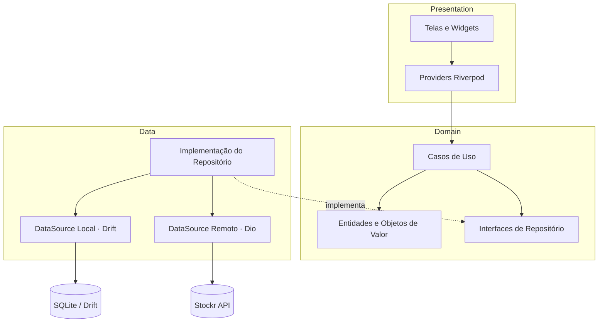
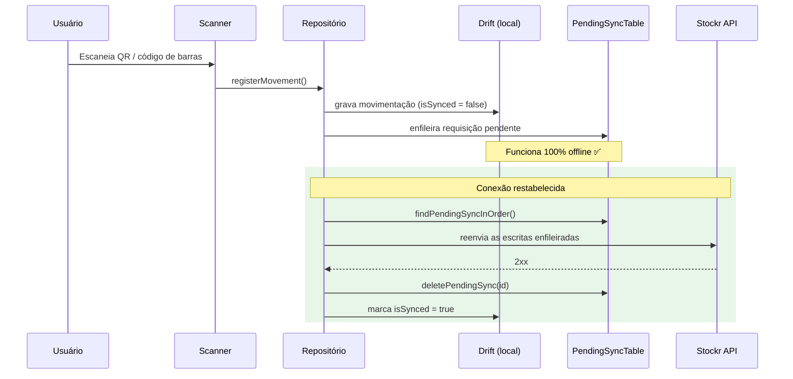

<h1 align="center">📦 Stockr App</h1>

<p align="center">
  <strong>Aplicativo de inventário e movimentação de estoque <em>offline-first</em> em Flutter.</strong><br>
  Escaneie um QR/código de barras, registre a movimentação <em>mesmo sem sinal</em> e
  deixe sincronizar automaticamente quando o aparelho voltar a ter conexão.
</p>

<p align="center">
  <a href="https://github.com/ThQMS/Stockr-app-/actions/workflows/ci.yml">
    
  </a>
  
  
  <a href="LICENSE"></a>
</p>

---

## 📑 Sumário

- [Visão geral](#-visão-geral)
- [O diferencial: offline-first de verdade](#-o-diferencial-offline-first-de-verdade)
- [Funcionalidades](#-funcionalidades)
- [Ecossistema](#-ecossistema)
- [Screenshots](#-screenshots)
- [Stack tecnológica](#-stack-tecnológica)
- [Arquitetura](#️-arquitetura)
- [Fluxo de sincronização offline-first](#-fluxo-de-sincronização-offline-first)
- [Modelo de dados](#-modelo-de-dados)
- [Começando](#-começando)
- [Configuração da API](#-configuração-da-api)
- [Estrutura de pastas](#️-estrutura-de-pastas)
- [Testes](#-testes)
- [CI/CD e releases](#-cicd-e-releases)
- [Roadmap](#️-roadmap)
- [Documentação](#-documentação)
- [Contribuindo](#-contribuindo)
- [Licença](#-licença)

## 🔎 Visão geral

O **Stockr App** é o cliente mobile de um sistema de controle de estoque pensado
para o mundo real de um depósito ou loja: redes instáveis, leitura de produtos no
corredor e necessidade de continuar trabalhando mesmo sem internet.

Ele foi construído com **Clean Architecture organizada por feature**, persistência
**local-first** com [Drift](https://drift.simonbinder.eu/) (SQLite) e
sincronização em segundo plano com a [Stockr API](https://github.com/ThQMS/Stockr-api).
A camada de domínio é Dart puro — não conhece Flutter, banco nem rede — o que torna
as regras de negócio fáceis de testar e de evoluir.

## ✨ O diferencial: offline-first de verdade

A maioria das demos de inventário quebra no instante em que o Wi-Fi do depósito cai.
O Stockr é construído ao contrário: **o banco de dados local é a fonte da verdade** e
a rede é tratada como um efeito colateral eventual.

- 📷 **UX centrada no scanner** — leitura de QR / código de barras com `mobile_scanner`.
- 🗄️ **Persistência local-first** — cada produto e movimentação vive num banco
  SQLite (Drift) no próprio aparelho.
- 🔁 **Sincronização em background** — as escritas são enfileiradas numa
  `PendingSyncTable` e reenviadas à API quando a conexão volta, com contagem de
  tentativas para retentativas.
- 🆔 **Idempotência** — os IDs são gerados no cliente *antes* de enfileirar, então
  reenviar a mesma escrita após uma resposta perdida não duplica nada no servidor.
- 🧱 **Clean Architecture por feature** — camadas `domain` / `data` / `presentation`,
  `Either` do `fpdart` para falhas tipadas e Riverpod para estado.

## 🧩 Funcionalidades

| Módulo | O que faz |
|--------|-----------|
| **Autenticação** | Login, cadastro e seleção de *workspace* (multi-tenant) |
| **Inventário** | Listagem de produtos, detalhes, registro de movimentações (entrada/saída) e histórico em formato de ledger (`quantityBefore` → `quantityAfter`) |
| **Scanner** | Leitura de QR/código de barras para localizar um produto e registrar movimentação na hora |
| **Relatórios** | Métricas de estoque e gráficos com `fl_chart` |
| **Sincronização** | Fila de pendências, reenvio ordenado (FIFO) e contador de itens pendentes |

Objetos de valor do domínio garantem regras consistentes em qualquer camada:
`ProductSku` (normalização), `StockQuantity` (status crítico/baixo/ok, subtração
segura) e `Money` (centavos inteiros, sem erro de ponto flutuante).

## 🌐 Ecossistema

O Stockr é dividido em dois repositórios que trabalham juntos:

| Repositório | Papel | Stack | Link |
|-------------|-------|-------|------|
| **Stockr App** (este repo) | Cliente mobile — scanner, cache offline, sync | Flutter · Dart · Drift · Riverpod | _você está aqui_ |
| **Stockr API** | Backend — auth, workspaces, produtos, movimentações | REST API (PHP) | [ThQMS/Stockr-api](https://github.com/ThQMS/Stockr-api) |

> O app se comunica com o backend através da variável de compilação `API_BASE_URL`
> (veja [`lib/core/network/dio_client.dart`](lib/core/network/dio_client.dart)).

## 📱 Screenshots

> _Adicione aqui screenshots / um GIF do fluxo offline — o roteiro que mais
> impressiona está em [docs/03-offline-sync.md](docs/03-offline-sync.md)._

| Produtos | Scanner | Relatórios |
|----------|---------|------------|
| _em breve_ | _em breve_ | _em breve_ |

## 🧰 Stack tecnológica

| Camada | Pacote | Para quê |
|--------|--------|----------|
| Estado | `flutter_riverpod`, `riverpod_annotation` | Gerência de estado reativa e testável |
| Navegação | `go_router` | Rotas declarativas (`/products`, `/scanner`, `/reports`) |
| Banco local | `drift`, `drift_flutter` | SQLite tipado, DAOs e migrações |
| Rede | `dio` | Cliente HTTP + interceptors (auth, workspace, conectividade) |
| Programação funcional | `fpdart` | `Either<Failure, T>` para falhas explícitas |
| Scanner | `mobile_scanner` | Leitura de QR / código de barras |
| Segurança | `flutter_secure_storage` | Armazenamento de tokens com criptografia |
| Preferências | `shared_preferences` | Configurações simples |
| Gráficos | `fl_chart` | Visualização de métricas |
| Injeção de dependências | `get_it` | Service locator (wiring manual em `injection_container.dart`) |
| Conectividade | `connectivity_plus` | Detecção de online/offline para o sync |
| Utilidades | `equatable`, `intl`, `path_provider` | Igualdade de valor, formatação, caminhos |

## 🏛️ Arquitetura

Clean Architecture fatiada **por feature** (`auth`, `inventory`, `scanner`,
`reports`). Cada feature é dona das suas três camadas; as dependências sempre
apontam para dentro — a camada de domínio nunca importa Flutter, Drift ou Dio.



**Tratamento de erros tipado.** Os casos de uso retornam `Either<Failure, T>` do
`fpdart` em vez de lançar exceções. As falhas (`ValidationFailure`,
`NetworkFailure`, `ServerFailure`, `InsufficientStockFailure`...) fazem parte
explícita do contrato, então o compilador obriga você a tratá-las.

## 🔁 Fluxo de sincronização offline-first



**Por que isso é robusto:**

- **Ordem** — as pendências são reenviadas na ordem de criação (FIFO), preservando
  a causalidade (um produto precisa existir antes de uma movimentação referenciá-lo).
- **Idempotência** — IDs gerados no cliente fazem a API tratar reenvios como
  *upsert*, sem duplicar.
- **Tentativas** — o contador `attempts` permite *backoff* e evita que uma única
  mensagem "venenosa" trave a fila.

Aprofunde em [docs/03-offline-sync.md](docs/03-offline-sync.md).

## 🗃️ Modelo de dados

Quatro tabelas Drift (esquema versionado, `schemaVersion = 1`):

- **Products** — catálogo com estoque atual/mínimo, preços em centavos e flags de sync.
- **Movements** — ledger *append-only* de entradas/saídas (`quantityBefore`/`quantityAfter`).
- **PendingSync** — fila de escritas a reenviar (`endpoint`, `method`, `body`, `attempts`).
- **Categories** — categorias hierárquicas por workspace.

Diagrama ER completo e notas de design em [docs/04-data-layer.md](docs/04-data-layer.md).

## 🚀 Começando

Requisitos: **Dart 3.6+** e **Flutter 3.27+**.

```sh
# 1. Instalar dependências
flutter pub get

# 2. Gerar o código (Drift / Riverpod)
dart run build_runner build --delete-conflicting-outputs

# 3. Rodar, apontando para a sua instância do backend
flutter run --dart-define=API_BASE_URL=http://10.0.2.2:8080
```

> `10.0.2.2` é a máquina host vista de dentro do emulador Android. Para um aparelho
> físico, use o IP da sua máquina na LAN ou a URL de uma API publicada.

Guia detalhado em [docs/01-getting-started.md](docs/01-getting-started.md).

## ⚙️ Configuração da API

A URL base é uma constante **de tempo de compilação**, lida de `API_BASE_URL`
([`lib/core/network/dio_client.dart`](lib/core/network/dio_client.dart)). O padrão
é `https://api.example.com`, então sobrescreva conforme o ambiente:

| Ambiente | Comando |
|----------|---------|
| Emulador Android → host | `flutter run --dart-define=API_BASE_URL=http://10.0.2.2:8080` |
| Simulador iOS → host | `flutter run --dart-define=API_BASE_URL=http://localhost:8080` |
| Aparelho físico (mesma rede) | `flutter run --dart-define=API_BASE_URL=http://192.168.0.10:8080` |
| Build de release | `flutter build apk --release --dart-define=API_BASE_URL=https://sua-api.com` |

## 🗂️ Estrutura de pastas

```text
lib/
├── core/                  # Infraestrutura transversal
│   ├── database/          # Banco Drift, tabelas e DAOs
│   ├── di/                # Service locator (get_it) — wiring manual
│   ├── error/             # Failures e exceptions
│   ├── network/           # Cliente Dio + interceptors (auth, workspace, conectividade)
│   ├── router/            # Configuração do go_router
│   ├── theme/             # Cores e ThemeData
│   └── usecases/          # Contrato base de UseCase
└── features/
    ├── auth/              # Login, cadastro, workspaces
    │   ├── domain/        #   entidades, repositórios (interfaces), casos de uso
    │   ├── data/          #   models, datasources, implementações de repositório
    │   └── presentation/  #   (telas e widgets)
    ├── inventory/         # Produtos e movimentações de estoque
    ├── scanner/           # Leitura de QR / código de barras
    └── reports/           # Métricas e gráficos de inventário
```

## 🧪 Testes

```sh
flutter test                 # roda tudo
flutter test --coverage      # com cobertura -> coverage/lcov.info
```

A suíte cobre os objetos de valor do domínio e a **lógica de sincronização** (o
coração do app), além de um widget test. Convenções e exemplos em
[docs/05-testing.md](docs/05-testing.md).

## 🔄 CI/CD e releases

Automação via **GitHub Actions**:

- **CI** ([`ci.yml`](.github/workflows/ci.yml)) — roda em todo push e PR:
  `dart format` (verificação), `flutter analyze`, `flutter test` e build de APK
  debug, garantindo reprodutibilidade via `pubspec.lock` versionado.
- **Release** ([`release.yml`](.github/workflows/release.yml)) — disparado por uma
  tag `v*` (ou manualmente): builda os APKs de release por ABI e **publica o
  GitHub Release com os binários anexados** automaticamente.

Para lançar uma versão: atualize o [CHANGELOG](CHANGELOG.md), crie a tag
(`git tag v1.1.0 && git push origin v1.1.0`) e o workflow cuida do resto.

## 🗺️ Roadmap

- [ ] Telas de autenticação (UI) conectadas aos casos de uso
- [ ] GIF do fluxo offline no README
- [ ] Resolução de conflitos mais rica (além de last-write-wins)
- [ ] Testes de widget para as telas principais
- [ ] Internacionalização (i18n) além do pt-BR
- [ ] Deploy da API em *free tier* para demo ponta a ponta

## 📚 Documentação

| # | Documento | Conteúdo |
|---|-----------|----------|
| 01 | [Getting started](docs/01-getting-started.md) | Instalar, gerar código, configurar a API, rodar |
| 02 | [Arquitetura](docs/02-architecture.md) | Camadas, regra de dependência, state management |
| 03 | [Sincronização offline](docs/03-offline-sync.md) | Fila de pendências, idempotência, conflitos |
| 04 | [Camada de dados](docs/04-data-layer.md) | Esquema do Drift, DAOs, repositórios |
| 05 | [Testes](docs/05-testing.md) | O que é testado e as convenções |

## 🤝 Contribuindo

Issues e PRs são bem-vindos — leia o [CONTRIBUTING.md](CONTRIBUTING.md) e o
[Código de Conduta](CODE_OF_CONDUCT.md). Reportes de segurança: [SECURITY.md](SECURITY.md).

## 📄 Licença

Distribuído sob a [Licença MIT](LICENSE).
