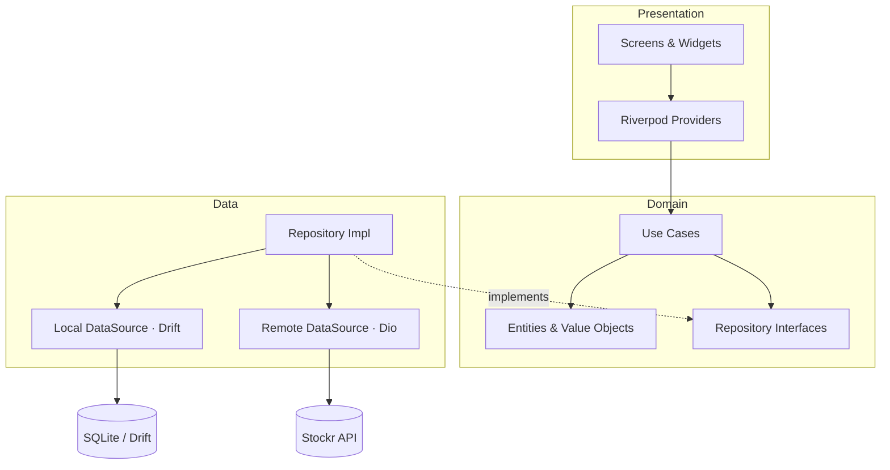
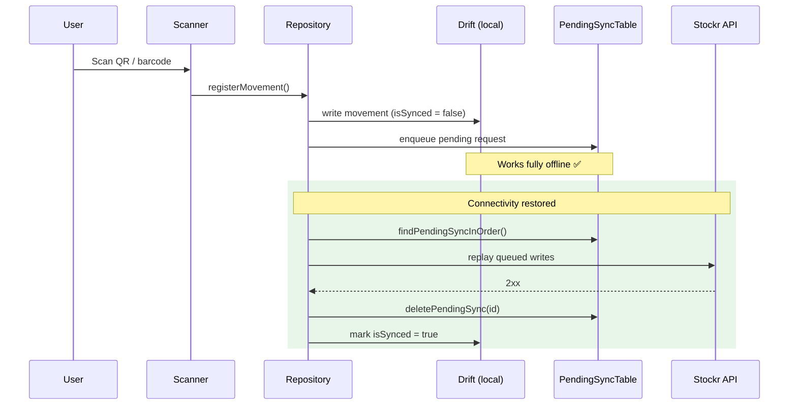

<h1 align="center">📦 Stockr App</h1>

<p align="center">
  <strong>Offline-first inventory & stock-movement app for Flutter.</strong><br>
  Scan a QR/barcode, register the movement <em>even with no signal</em>, and let it
  sync automatically when the device is back online.
</p>

<p align="center">
  <a href="https://github.com/ThQMS/Stockr-app-/actions/workflows/ci.yml">
    
  </a>
  
  
  <a href="LICENSE"></a>
</p>

---

## ✨ The differential — offline-first with real sync

Most inventory demos break the moment the warehouse Wi-Fi drops. Stockr is built
the other way around: **the local database is the source of truth**, and the
network is treated as an eventual side effect.

- 📷 **Scan-first UX** — QR / barcode scanning with `mobile_scanner`.
- 🗄️ **Local-first persistence** — every product and movement lives in a
  [Drift](https://drift.simonbinder.eu/) SQLite database on device.
- 🔁 **Background sync** — writes are queued in a `PendingSyncTable` and flushed
  to the [Stockr API](https://github.com/ThQMS/Stockr-api) when connectivity
  returns, with attempt tracking for retries.
- 🧱 **Clean Architecture by feature** — `domain` / `data` / `presentation`
  layers, `fpdart` `Either` for typed failures, Riverpod for state.

## 🌐 Ecosystem

Stockr is split into two repositories that work together:

| Repo | Role | Stack | Link |
|------|------|-------|------|
| **Stockr App** (this repo) | Mobile client — scanning, offline cache, sync | Flutter · Dart · Drift · Riverpod | _you are here_ |
| **Stockr API** | Backend — auth, workspaces, products, movements | PHP REST API | [ThQMS/Stockr-api](https://github.com/ThQMS/Stockr-api) |

> The app talks to the backend through the `API_BASE_URL` compile-time variable
> (see [`lib/core/network/dio_client.dart`](lib/core/network/dio_client.dart)).

## 📱 Screenshots

> _Add screenshots / a GIF of the offline flow here — see
> [docs/03-offline-sync.md](docs/03-offline-sync.md) for the scenario worth recording._

| Products | Scanner | Reports |
|----------|---------|---------|
| _coming soon_ | _coming soon_ | _coming soon_ |

## 🚀 Getting started

Requirements: **Dart 3.6+** and **Flutter 3.27+**.

```sh
# 1. Install dependencies
flutter pub get

# 2. Generate Drift / Riverpod / Injectable code
dart run build_runner build --delete-conflicting-outputs

# 3. Run, pointing at your backend instance
flutter run --dart-define=API_BASE_URL=http://10.0.2.2:8080
```

> `10.0.2.2` is the host machine as seen from the Android emulator. For a real
> device, use your machine's LAN IP or a deployed API URL.

More detail in [docs/01-getting-started.md](docs/01-getting-started.md).

## 🏛️ Architecture

Clean Architecture, sliced **by feature** (`auth`, `inventory`, `scanner`,
`reports`). Each feature owns its three layers; dependencies always point inward.



### Offline-first sync flow



Deep dive: [docs/02-architecture.md](docs/02-architecture.md) ·
[docs/03-offline-sync.md](docs/03-offline-sync.md).

## 🗂️ Project structure

```text
lib/
├── core/                  # Cross-cutting infrastructure
│   ├── database/          # Drift database, tables & DAOs
│   ├── di/                # Injectable / get_it wiring
│   ├── error/             # Failures & exceptions
│   ├── network/           # Dio client + interceptors (auth, workspace, connectivity)
│   ├── router/            # go_router configuration
│   ├── theme/             # Colors & ThemeData
│   └── usecases/          # UseCase base contract
└── features/
    ├── auth/              # Login, register, workspaces
    ├── inventory/         # Products & stock movements (domain/data/presentation)
    ├── scanner/           # QR / barcode scanning
    └── reports/           # Inventory metrics & charts
```

## 🧪 Tests

```sh
flutter test
```

See [docs/05-testing.md](docs/05-testing.md) for what is covered and the testing
conventions.

## 🤝 Contributing

Issues and PRs are welcome — please read [CONTRIBUTING.md](CONTRIBUTING.md) and
the [Code of Conduct](CODE_OF_CONDUCT.md). Security reports: [SECURITY.md](SECURITY.md).

## 📄 License

Released under the [MIT License](LICENSE).
