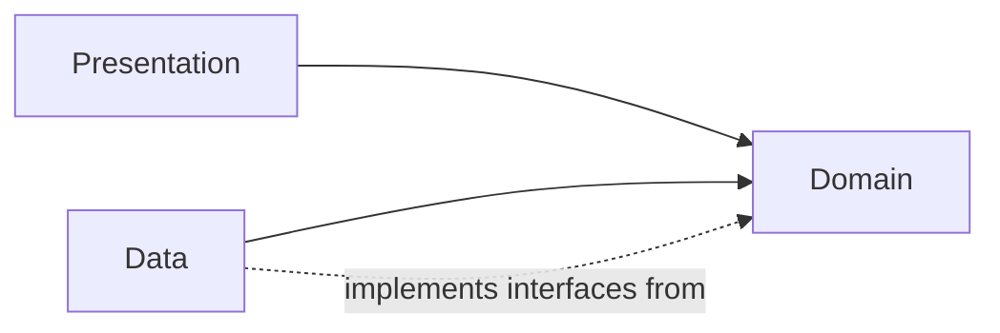

# 02 · Architecture

Stockr follows **Clean Architecture, sliced by feature**. Instead of a global
`data/`, `domain/`, `presentation/` split, each feature (`auth`, `inventory`,
`scanner`, `reports`) owns its own three layers. Cross-cutting infrastructure
lives in `core/`.

## Dependency rule

Dependencies always point **inward**. The domain layer knows nothing about
Flutter, Drift or Dio.



- **Domain** — pure Dart. Entities, value objects, repository *interfaces*, and
  use cases. No framework imports.
- **Data** — implements the domain interfaces. Talks to Drift (local) and Dio
  (remote), maps rows/JSON into entities.
- **Presentation** — Flutter widgets driven by Riverpod providers, which call
  use cases.

## Layers in practice

| Layer | Examples in this repo |
|-------|-----------------------|
| Domain · entities | `Product`, `Movement`, `Workspace` |
| Domain · value objects | `ProductSku`, `StockQuantity`, `Money` |
| Domain · use cases | `ScanProductUseCase`, `RegisterMovementUseCase`, `SyncPendingMovementsUseCase` |
| Domain · contracts | `ProductRepository`, `MovementRepository` |
| Data · sources | `ProductLocalDataSource` (Drift), `ProductRemoteDataSource` (Dio) |
| Data · repositories | `ProductRepositoryImpl`, `MovementRepositoryImpl` |
| Presentation | `ProductsScreen`, `ScannerScreen`, `ReportsScreen` + providers |

## Error handling — typed failures

Use cases return `Either<Failure, T>` from [`fpdart`](https://pub.dev/packages/fpdart)
rather than throwing. Failures are an explicit, exhaustive part of the contract:

```dart
Future<Either<Failure, Product>> call(ScanProductParams params) async {
  if (params.code.trim().isEmpty) {
    return const Left(ValidationFailure('Invalid scan', errors: {...}));
  }
  try {
    return await _repository.scanByCode(...);
  } catch (error) {
    return Left(ServerFailure(error.toString()));
  }
}
```

## State management — Riverpod

The presentation layer uses `flutter_riverpod` / `riverpod_annotation`. The app
is wrapped in a `ProviderScope` (see [`lib/main.dart`](../lib/main.dart)) and
providers expose use-case results to the widgets.

## Dependency injection

`get_it` is used as a service locator. `configureDependencies()` runs at startup
before `runApp`, and the wiring is declared manually in
[`lib/core/di/injection_container.dart`](../lib/core/di/injection_container.dart)
(plain, committed source — there is no annotation-based codegen here).

## Navigation

`go_router` declares the route table in
[`lib/core/router/app_router.dart`](../lib/core/router/app_router.dart):
`/products` (with `/products/:id`), `/scanner`, `/reports`.

## Networking

A thin `DioClient` wraps Dio with a configurable base URL and a stack of
interceptors:

- `auth_interceptor` — attaches the bearer token
- `workspace_interceptor` — scopes requests to the active workspace
- `connectivity_interceptor` — short-circuits when offline
