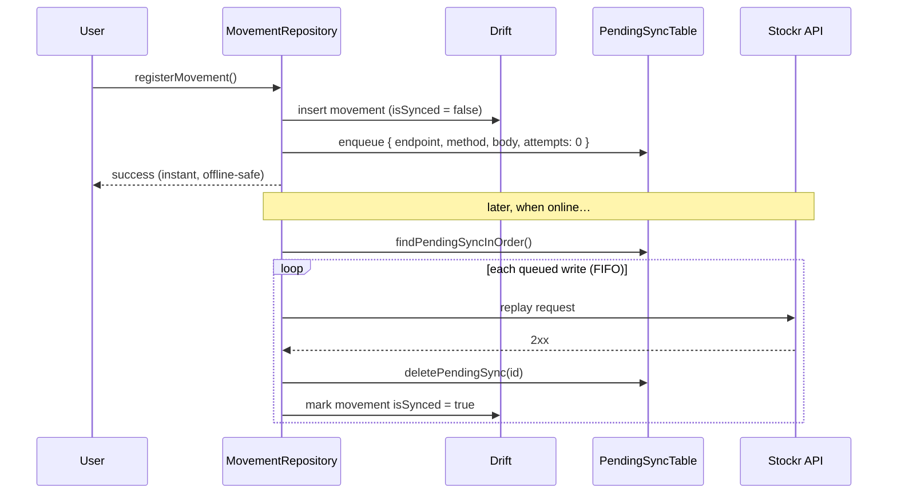

# 03 · Offline-first sync

This is the document worth reading. Stockr is designed so the warehouse operator
can keep working with **no connectivity** and never lose a stock movement.

## Principle: local is the source of truth

Every write goes to the on-device Drift database first. The network is an
*eventual* side effect, not a precondition. The UI never blocks on a request.



## The pending queue

The queue is a first-class table
([`lib/core/database/app_database.dart`](../lib/core/database/app_database.dart)):

```dart
class PendingSyncTable extends Table {
  TextColumn get id => text()();          // client-generated id
  TextColumn get endpoint => text()();    // where to replay
  TextColumn get method => text()();      // POST / PATCH / ...
  TextColumn get body => text()();        // serialized payload
  IntColumn  get attempts => integer().withDefault(const Constant(0))();
  DateTimeColumn get createdAt => dateTime()();
  @override
  Set<Column> get primaryKey => {id};
}
```

Movements themselves carry an `isSynced` flag (default `false`), so the local DB
always knows what has and hasn't reached the server.

## Ordering & idempotency

- **Order** — pending writes are replayed in creation order
  (`findPendingSyncInOrder`), preserving causal sequence (a product must exist
  before a movement references it).
- **Idempotency** — ids are **client-generated** before the request is enqueued
  (e.g. `DateTime.now().microsecondsSinceEpoch`). Replaying the same queued
  write carries the same id, so a retry after a dropped response does not create
  duplicates server-side. The API is expected to treat the id as an idempotency
  key (upsert semantics).
- **Attempts** — the `attempts` counter exists to back off / cap retries on
  writes that keep failing, so a single poison message can't stall the queue.

## Conflict resolution

The current strategy is **last-write-wins per record**, keyed by the
client-generated id plus `updatedAt` / `syncedAt` timestamps on the product row:

- `updatedAt` — last local mutation
- `syncedAt` — last successful reconciliation with the server

When the server copy is newer than `syncedAt`, the pulled value wins; local
unsynced movements are still replayed on top. Because movements are *additive*
ledger entries (not in-place edits of a stock number), they compose without
clobbering each other.

## Connectivity trigger

`connectivity_plus` detects when the device regains a connection; the
`connectivity_interceptor` prevents doomed requests while offline, and
`SyncPendingMovementsUseCase` drains the queue once back online:

```dart
// SyncPendingMovementsUseCase
final pendingCount = await _repository.getPendingSyncCount();
if (pendingCount == 0) return const Right(0);
final result = await _repository.syncPending(); // replays + clears the queue
```

## 🎥 Demo worth recording

The single most convincing artifact for this project:

1. Enable airplane mode.
2. Scan a product and register a movement → it saves instantly.
3. Show the pending-sync badge count increasing.
4. Re-enable the network.
5. Watch the queue drain and the badge return to zero.

Capture it as a GIF and embed it in the root `README.md`.
