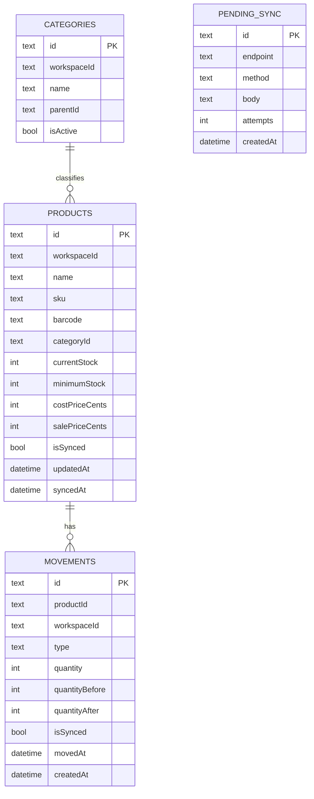

# 04 · Data layer

Local persistence is handled by [Drift](https://drift.simonbinder.eu/) (typed
SQLite). The schema, DAOs and the open-connection helper live in
[`lib/core/database/`](../lib/core/database/).

## Schema (v1)



### Design notes

- **Money as integer cents** — `costPriceCents` / `salePriceCents` avoid floating
  point rounding. The `Money` value object formats them for display.
- **Movements are an append-only ledger** — each row records `quantityBefore`
  and `quantityAfter`, so stock history is auditable and sync stays additive.
- **`isSynced` flags** — products and movements both track whether they've
  reached the server; `syncedAt` records the last reconciliation.
- **`workspaceId` everywhere** — every row is workspace-scoped to support
  multi-tenant accounts (mirrors the API's workspace model).

## DAOs

| DAO | Responsibilities |
|-----|------------------|
| `ProductDao` | CRUD for products, low-stock queries |
| `MovementDao` | Insert movements, query by product/workspace, **pending-sync** queries (`countPendingSync`, `findPendingSyncInOrder`, `deletePendingSync`) |

## Repositories

Repositories implement the domain contracts and orchestrate local + remote
sources. Example — registering a movement writes locally first
([`movement_repository_impl.dart`](../lib/features/inventory/data/repositories/movement_repository_impl.dart)):

```dart
await _database.movementDao.insertMovement(
  MovementsTableCompanion.insert(
    id: model.id,                 // client-generated -> idempotent
    productId: model.productId,
    type: model.type.name,
    quantity: model.quantity,
    movedAt: model.occurredAt,
    createdAt: DateTime.now(),
  ),
);
```

## Migrations

`schemaVersion` is `1`. The `MigrationStrategy` creates all tables on first run;
future schema changes go in the `onUpgrade` callback. Bump `schemaVersion` and
add the migration step there whenever a table changes.

## Code generation

Drift generates `app_database.g.dart` from the table definitions. It is **not**
committed — run `dart run build_runner build --delete-conflicting-outputs` after
changing any table or DAO.
